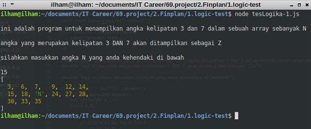
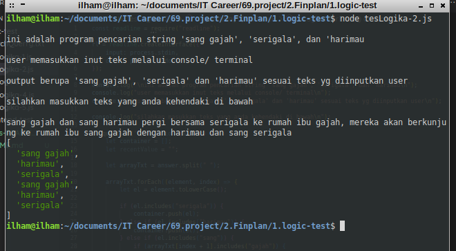
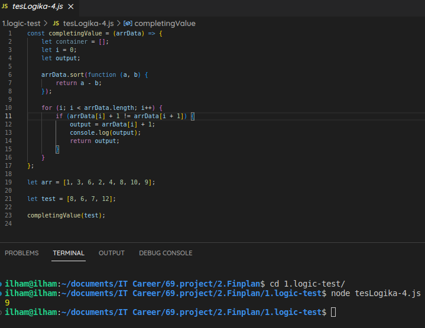
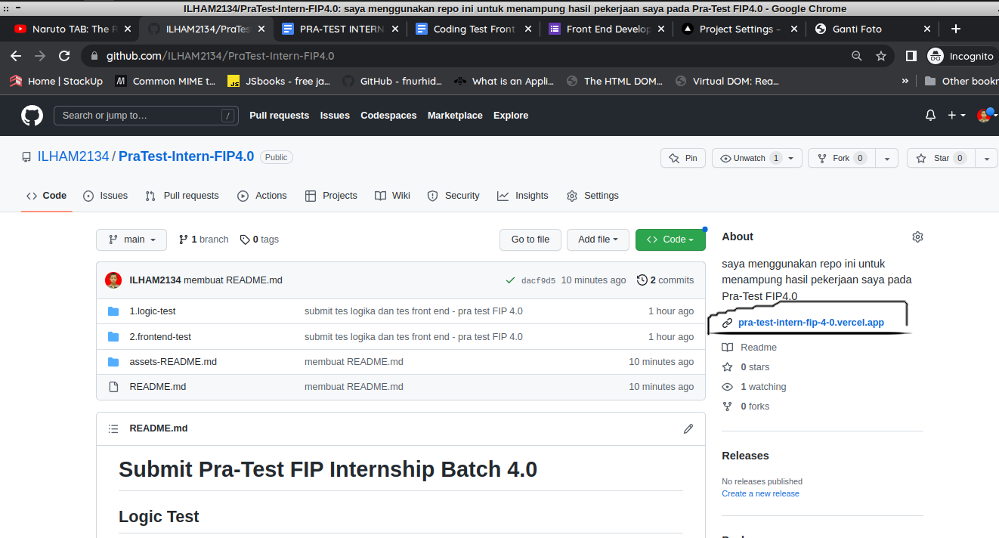

# Submit Pra-Test FIP Internship Batch 4.0

## Logic Test

### Tes Logika 1

-   menggunakan module readline yang berjalan pada environment NodeJS, sehingga tidak bisa dijalankan pada browser
-   cara menjalankannya adalah dengan pull / clone / download file terlebih dahulu, kemudian memastikan bahwa NodeJS sudah terpasang di lokal
-   menuju ke direktori tempat file tesLogika-1.js berada (terdapat dalam folder 1.logic-test)
-   menjalankan kode dengan command pada terminal :

```
node tesLogika-1.js
```

-   mengikuti petunjuk yang tertera pada terminal console



### Tes Logika 2

-   menggunakan module readline yang berjalan pada environment NodeJS, sehingga tidak bisa dijalankan pada browser
-   cara menjalankannya adalah dengan pull / clone / download file terlebih dahulu, kemudian memastikan bahwa NodeJS sudah terpasang di lokal
-   menuju ke direktori tempat file tesLogika-2.js berada (terdapat dalam folder 1.logic-test)
-   menjalankan kode dengan command pada terminal :

```
node tesLogika-2.js
```

-   mengikuti petunjuk yang tertera pada terminal console



-   hasil akan ditampilkan dalam bentuk array

### Tes Logika 3

-   menggunakan module readline yang berjalan pada environment NodeJS, sehingga tidak bisa dijalankan pada browser
-   cara menjalankannya adalah dengan pull / clone / download file terlebih dahulu, kemudian memastikan bahwa NodeJS sudah terpasang di lokal
-   menuju ke direktori tempat file tesLogika-3.js berada (terdapat dalam folder 1.logic-test)
-   menjalankan kode dengan command pada terminal :

```
node tesLogika-3.js
```

-   mengikuti petunjuk yang tertera pada terminal console

.png> "output-tes-logika-3")
.png> "output-tes-logika-3")

-   hasil akan ditampilkan dalam bentuk array

### Tes Logika 4

-   tidak menggunakan module NodeJS, sehingga bisa dijalankan di browser / environment JS lain
-   cara menjalankan apabila di lokal bisa dengan menuju ke direktori tempat file tesLogika-4.js berada (terdapat dalam folder 1.logic-test)
-   mengetikkan command pada terminal

```
node tesLogika-4.js
```

-   output bisa langsung terlihat, karena saya telah membuat array utk mengecek program ini



### Tes Logika 5

-   program belum jadi, akan menyusul kemudian
-   khawatir lupa submit, akhirnya saya submit saja
-   kalau ada perbaikan, akan saya push

## Front End Test

-   dibuat menggunakan HTML, CSS, Bootstrap, dan library sweetalert2
-   file halaman web utama adalah index.html yang terletak di dalam folder 2.frontend-test
-   cara menjalankannya adalah :

    -   pull / clone / download seluruh folder 2.frontend-test
    -   buka file index.html menggunakan browser (chrome recommended)
    -   pastikan mengizinkan akses kamera untuk menangkap gambar
    -   sudah bisa digunakan sesuai design userflow figma

-   cara lain yang lebih mudah adalah dengan mengklik lik pada bawah section about


